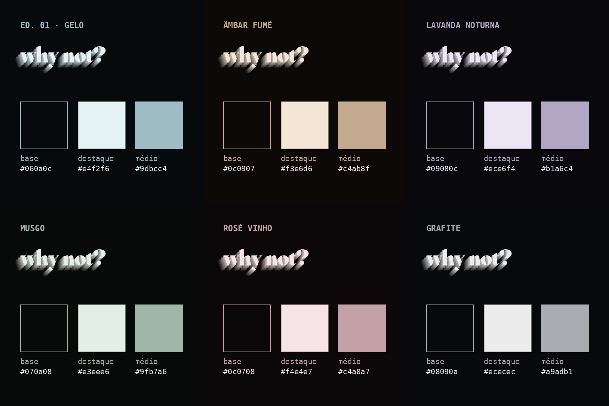

# why not? — identidade da label

> *Uma vez por mês. Nunca igual.*
> Label de festas · São José do Rio Preto · edição 01 em parceria com @ballyclub.oficial
> Instagram: **@whynot.sjrp** · links: **beacons.ai/whynoooot**

Documento-mestre da marca. Tudo o que é publicado pela why not? deve seguir o que está aqui.
Versão 1.0 · outubro de 2026 · edição 01 (sexta, 09.10, Bally Club)

---

## 1. Essência e posicionamento

**O que é:** uma **label de festas** mensal e com curadoria. A edição 01 acontece na Bally Club. A partir daí, a why not? vai para **locais exclusivos, com estrutura de palco e camarotes**. Cada edição tem um lugar, um line-up e uma experiência diferentes. O nome é a própria provocação: *por que não?*

**Posicionamento:** a noite **premium e exclusiva** de Rio Preto. A marca é a why not?, não o lugar: o público segue a label aonde ela for. Não é a festa mais barata nem a maior. É a que **todo mundo quer estar dentro**. O valor da marca vem de três coisas:

| Pilar | Como aparece |
|---|---|
| **Exclusividade** | Lista VIP feita só dentro do grupo de WhatsApp. Valores só no grupo. "Quem vai, sabe." |
| **Curadoria** | Line-up revelado um a um, com DJs de nome (ex.: 2× Tomorrowland) e da cena local. |
| **Estética** | Visual escuro, elegante e consistente. Nada de flyer poluído. |
| **Experiência** | Locais exclusivos, palco montado e camarotes a cada edição (a partir da ed. 02). |

**Público-alvo:** 18 a 30 anos, Rio Preto e região (~30 km), vida noturna, música eletrônica e funk.
**Âncora do público:** as mulheres. A lista VIP é delas, porque elas trazem o público masculino.

**Slogans oficiais:**
- *why not?* (assinatura de tudo)
- *Uma vez por mês. Nunca igual.* (versão para quando a festa muda de lugar)
- *Uma vez por mês. Uma casa. Nunca igual.* (usada no manifesto da ed. 01, na Bally)
- *Nem toda noite é igual. Nem todo mundo entende.*
- *Só mais uma? why not?*
- *Você não escolhe entrar. A lista escolhe você.*
- *Quem vai, sabe. Quem não foi, vai ouvir falar.*

---

## 2. Tom de voz

- **Curto e seguro.** Frases de no máximo uma linha no visual. Nada de textão em arte.
- **Elegante, não formal.** Fala como alguém que está dentro, sem gíria forçada e sem emoji em excesso (no máximo 1 a 3 por legenda: 🖤 🍸 📍 👉).
- **Provoca, não implora.** "Garante o seu", "não deixa pra porta", "fica no grupo". Nunca "por favor venham".
- **Minúsculas no lettering** (*why not?*, *é amanhã.*, *a lista VIP é delas.*). Caixa alta só nas informações em fonte mono.
- **Nunca no Instagram:** valores, "lista não reabre", tom de desconto ou promoção.

---

## 3. Logo / wordmark

**"why not?"** em **Fraunces Black (900)**, na cor de destaque da edição (ed. 01: azul-gelo), com **extrusão 3D em degraus** descendo para a esquerda (12 camadas, do tom claro até a base escura).

| Uso | Regra |
|---|---|
| Artes tipográficas (manifesto, stories, capas) | Pode inclinar de **-6° a -10°**. |
| Flyers com fotos | **Reto**, menor, acima das fotos, para não brigar com os rostos. |
| Fundo escuro | Extrusão escura (destaque → base). |
| Fundo claro (destaque) | Letra na base escura, extrusão clara (tom médio → destaque). |
| Proibido | Esticar, trocar a fonte, colocar sobre foto colorida, usar sem a extrusão em peças principais. |

Arquivo do logo original: `assets/logo/logo-why-not.png` (1080×1080, fundo preto).

---

## 4. Cores

### Filosofia: o estilo é fixo, o tom muda
A why not? **sempre** tem a mesma cara: escura, simples, sem poluição e **low light**, como uma pista com pouca luz. O que pode mudar de uma edição para outra é o **tom de destaque**. A estrutura nunca muda.

| Sempre igual (fixo) | Pode mudar a cada edição (variável) |
|---|---|
| Fundo quase preto, com brilho suave no centro | O tom de destaque (gelo, âmbar, lavanda…) |
| Duas cores por peça: base escura + um tom claro e dessaturado | A rampa da extrusão 3D, gerada a partir do tom da edição |
| Fontes Fraunces + Space Mono | O duotone das fotos (sombra = base, luz = tom da edição) |
| "why not?" em 3D com extrusão em degraus | |
| Layout limpo, muito respiro, nada de efeito chamativo | |

### Regras para escolher o tom de uma edição
1. **Base sempre quase preta**, levemente puxada para o tom da edição (luminosidade abaixo de 5%).
2. **Um único tom de destaque**, claro e **dessaturado** (pastel apagado, nunca neon).
3. Tons de apoio saem do próprio destaque: um médio para textos secundários e um escuro para linhas.
4. **Brilho (glow) discreto:** um gradiente radial bem suave atrás do conteúdo, nunca uma luz forte.
5. **Proibido:** neon, gradiente com várias cores, mais de um destaque na mesma peça, fundo claro chapado em post de arte, sombras coloridas fortes.
6. Antes de fechar o tom, testar a legibilidade: o texto de 30 px precisa ser lido no celular com o brilho da tela baixo.

### Paleta da edição 01: "Gelo"
| Nome | HEX | Uso |
|---|---|---|
| **Base (preto why not)** | `#060a0c` | Fundo das artes e texto em fundo claro |
| **Destaque (azul-gelo)** | `#e4f2f6` | Fundo das capas de DJ, texto principal em fundo escuro |
| Médio | `#9dbcc4` | Textos secundários em fundo escuro |
| Petróleo | `#2f4e56` | Textos secundários em fundo claro |
| Linha escura | `#2a434b` | Divisórias em fundo escuro |
| Linha clara | `#9bbdc6` | Divisórias em fundo claro |
| Brilho (glow) | `#12302e` → `#0a1315` → `#060a0c` | Gradiente radial atrás do conteúdo |

Rampa da extrusão (fundo escuro, do topo para trás):
`#b3cfd6 · #9bbdc6 · #85abb5 · #7199a4 · #5f8792 · #4f7580 · #41646e · #35535c · #2a434b · #20343a · #17262b · #0f191d`

### Sugestões de tons para as próximas edições
Todas seguem as mesmas regras: base quase preta, destaque claro e dessaturado, low light.



| Nome | Base | Destaque | Médio | Clima |
|---|---|---|---|---|
| Âmbar fumê | `#0c0907` | `#f3e6d6` | `#c4ab8f` | Quente, luz de vela, lounge |
| Lavanda noturna | `#09080c` | `#ece6f4` | `#b1a6c4` | Etéreo, madrugada |
| Musgo | `#070a08` | `#e3eee6` | `#9fb7a6` | Natural, open air |
| Rosé vinho | `#0c0708` | `#f4e4e7` | `#c4a0a7` | Elegante, intimista |
| Grafite | `#08090a` | `#ececec` | `#a9adb1` | Neutro, puro preto e branco |

### Regra do feed (xadrez)
Cada post alterna a cor:
- **DJs = sempre o destaque claro da edição** (na ed. 01, azul-gelo), em Reels com capa clara.
- **Artes = sempre a base escura.**
- Ordem: DJ claro → arte escura → DJ claro → arte escura…

---

## 5. Tipografia

| Fonte | Peso | Uso |
|---|---|---|
| **Fraunces** (Google Fonts) | Black 900 | Títulos, nomes de DJ, datas grandes, wordmark |
| Fraunces | Italic 400 | Sublinhas emocionais ("a primeira hora é por nossa conta.", "é", "sua vez.") |
| **Space Mono** (Google Fonts) | 400 / 700 | Informações: data, horário, local, @, "ingressos na bio" |

**Regras de tamanho (arte com 1080 px de largura):**
- Informação mínima: **30 px** (nunca menor, para ler no celular).
- Mono em caixa alta, com espaçamento entre letras de 0,08 a 0,14 em (até 0,42 em em títulos de topo).
- Título principal: 120 a 250 px. Sublinha em itálico: 56 a 90 px.

---

## 6. Fotografia e vídeo

**Fotos de DJ:**
- Sempre **preto e branco com o tom da edição** (duotone: sombra = base, luz = destaque; na ed. 01, `#060a0c` → `#e4f2f6`), contraste +20%.
- Recortadas (sem fundo), da cintura para cima, com o rodapé esfumado no preto.
- Exportar sempre as fotos originais, nunca prints de outros flyers.

**Reels de DJ (padrão da edição 01):**
- 9:16, 1080×1920, até 10 segundos, preto e branco com grão.
- Estrutura: abertura "why not? apresenta · line-up." (1,2 s) → 5 cortes de 1,2 s com nome + destaque embaixo → capa do DJ no final.
- Sem logos de outras festas nas imagens (recortar ou desfocar).
- Capa: no tom claro da edição (ed. 01: azul-gelo), foto do DJ, "Line-up · 0X / 06", nome em 3D, destaque, @ do DJ.

---

## 7. Formatos e grids

| Formato | Tamanho | Margens / área segura |
|---|---|---|
| Feed | 1080×1350 (4:5) | 80 px nas laterais |
| Stories | 1080×1920 (9:16) | 250 px livres no topo, 330 px embaixo (figurinhas e botões) |
| Reels | 1080×1920 | Capa em 9:16; o grid mostra o centro em 3:4 |
| Capas de destaque | 1080×1920 | Ícone centralizado |
| Exportação | **PNG, 2× (2160 px de largura)** | Para não perder nitidez no celular |

**Destaques do perfil:** Ed. 01 · Lista VIP · Grupo · Ingressos.

---

## 8. Regras de comunicação da edição 01

- **Data:** sexta, 09.10, 22h, Bally Club, Av. Dr. Alberto Andaló, 3837.
- **Open gin:** das 22h às 23h.
- **Lista VIP:** feita **só no grupo de WhatsApp**. Abre **08.10** e fecha **09.10 às 20h**. Não reabre.
- **Valores:** só na arte "Valores" dentro do grupo, **nunca no Instagram**.
  - Elas: free até 00h com nome na lista; depois da 00h, R$ 20 (regra da casa).
  - Eles: R$ 30 até 00h, na lista ou antecipado no site; depois da 00h, valor sujeito a alteração conforme as regras da casa.
- **Line-up:** @tomkellermusic · @djcoiote · @makaadj · @mexsymusic · @maycon_beats · @_possani04.
  Principais: Coiote e Maka.

---

## 9. Fluxo do cliente e funil de vendas

```
 DESCOBERTA            CONEXÃO                 LEAD QUENTE             COMPRA                PÓS-FESTA
 ──────────            ───────                 ───────────             ──────                ─────────
 Anúncio patrocinado → Perfil @whynot.sjrp  →  Grupo do WhatsApp   →   Ingresso antecipado → Fotos + marcações
 Reels dos DJs         (grid, destaques,       (link na bio)           (link da Bally)        Grupo continua vivo
 Collab com DJs/Bally   bio com links)         Lista VIP (elas)        Nome na lista          Anúncio da ed. 02
```

### Etapa 1 · Descoberta (topo): fazer a pessoa chegar no perfil
- **Anúncio patrocinado** com o flyer dos 6 DJs, objetivo "Mais visitas ao perfil".
- **Reels de cada DJ** sempre em **Collab** com o DJ, para aparecer para os seguidores dele.
- **Collab com @ballyclub.oficial** nos posts-chave (save the date, line-up, é amanhã).
- **Pedir repost** para cada DJ no dia do Reels dele.

### Etapa 2 · Conexão (meio): transformar visita em seguidor e membro do grupo
- **Bio** curta com a data e dois links claros: grupo (lista VIP) e ingressos.
- **Destaques** organizados (Ed. 01, Lista VIP, Grupo, Ingressos).
- **Todo story tem um destino:** figurinha de link do grupo, enquete ou caixinha.
- **Post "a lista VIP é delas"** e story "só entra na lista quem está no grupo": é o principal ímã de leads.

### Etapa 3 · Lead quente: o grupo do WhatsApp
Quem entra no grupo **já demonstrou interesse**. É ali que a venda acontece.
- Mensagem fixada: **datas da lista** (abre 08.10, fecha 09.10 às 20h).
- Arte de **valores** (só no grupo).
- Aquecimento diário com conteúdo exclusivo: line-up em primeira mão, bastidores, enquetes.

### Etapa 4 · Compra: gatilhos para o ingresso antecipado
Usar **um gatilho por dia**, no grupo e nos stories (nunca todos de uma vez):

| Gatilho | Onde | Ideia de post / mensagem |
|---|---|---|
| **Exclusividade** | Story + grupo | "A lista VIP é só pra quem tá no grupo." |
| **Escassez de tempo** | Grupo | "Antecipado vale até 00h. Depois, valor da casa." |
| **Urgência** | Story contagem + grupo | "Faltam 3 dias." / "A lista fecha hoje às 20h." |
| **Reciprocidade** | Post + story | "A primeira hora é por nossa conta: open gin das 22h às 23h." |
| **Autoridade** | Reels | "2× Tomorrowland" (Tom Keller), destaque de cada DJ. |
| **Prova social** | Story | Repost de quem marcou, prints do grupo cheio, "X pessoas já na lista" (só com número real). |
| **Pertencimento** | Grupo | "Quem tá no grupo sabe antes. Fica no grupo." |
| **Curiosidade** | Story | Silhueta do próximo DJ ("quem será?"), vídeo de spoiler. |
| **Antecipação** | Post | "Não deixa pra porta." (arte Antecipa) |

### Etapa 5 · Pós-festa: reter e preparar a próxima
- No dia 10 ou 11: carrossel de fotos + story agradecendo + repost das marcações.
- Caixinha "quem você quer na ed. 02?" e enquete de DJ.
- **Manter o grupo vivo** (não apagar): ele é a base de leads da próxima edição.
- Anunciar a ed. 02 primeiro no grupo e depois no Instagram.
- **Revelar o novo local aos poucos** (mistério → pistas → revelação), do mesmo jeito que o line-up.

### Camarotes (a partir da ed. 02)
O camarote é o ingresso de **maior valor** e tem um funil próprio, mais curto e mais pessoal:
- **Quem compra:** grupos de amigos, aniversariantes, empresários e casais.
- **Onde captar:** destaque "Camarotes" no perfil, story com caixinha "quer reservar seu camarote?" e mensagem no grupo para quem já foi na ed. 01.
- **Como fechar:** atendimento direto no WhatsApp (link de reserva), mapa de camarotes com os que já foram vendidos (escassez real) e garantia da reserva com sinal.
- **Gatilhos:** escassez ("restam 3 camarotes"), status (vista do palco, entrada exclusiva) e antecipação (quem reserva primeiro escolhe o lugar).

---

## 10. Mensagens prontas para o grupo

**Boas-vindas (fixar):**
> Bem-vindo à why not? 🖤 Aqui você fica sabendo de tudo primeiro: line-up, lista VIP e avisos da noite. A lista abre quinta, 08.10, e fecha sexta, 09.10, às 20h. Fica no grupo.

**Aquecimento (dias de DJ):**
> Mais um nome confirmado pra sexta 👀 [nome do DJ]. Já garantiu o seu antecipado? Link: [link de ingressos]

**Abertura da lista (08.10):**
> 📌 A lista VIP está ABERTA. Manda seu nome completo aqui. Fecha amanhã, às 20h, e não reabre.

**Urgência (09.10, 18h):**
> Últimas 2 horas de lista. Depois das 20h, só na próxima edição. Open gin das 22h às 23h: chega cedo.

**Último aviso (09.10, 19h30):**
> Últimos 30 minutos. Manda o nome agora. 🖤

---

## 11. Expansão da label

| Fase | O que muda |
|---|---|
| Ed. 01 | Bally Club, 6 DJs, lista VIP no grupo, open gin |
| Ed. 02 em diante | Locais exclusivos, estrutura de palco, venda de camarotes, revelação do local como parte da campanha |
| Sempre | Mesmo estilo (base escura + um tom claro, low light, Fraunces + Space Mono), mesmo tom de voz e o grupo do WhatsApp como base de leads. O tom de cor pode mudar por edição. |

Cada novo local entra na comunicação como **parceiro da edição**, nunca como dono da marca.

## 12. Métricas para acompanhar a cada edição

- Seguidores (início × fim da campanha)
- Visitas ao perfil vindas do anúncio
- Membros no grupo do WhatsApp
- Cliques nos links da bio
- Nomes na lista VIP
- Ingressos antecipados vendidos (dado do local / bilheteria)
- Camarotes vendidos (a partir da ed. 02)
- Público total na noite

Registrar os números de cada edição para comparar com a próxima.

---

## 13. Arquivo de peças (edição 01)

As artes ficam no canvas "why not? — posts de lançamento" e, exportadas em HD, na pasta `edicao-01/` deste repositório:
- `feed/`: teaser, manifesto, save the date, a lista VIP é delas, open gin, nem toda noite é igual, só mais uma?, antecipa, line-up completo, é amanhã
- `reels/`: vídeos e capas dos DJs, teaser, story "até agora"
- `stories/`: contagem, lista só pelo grupo, open gin, vota no DJ, dia da festa (14h, 18h, 19h30, 20h)
- `whatsapp/`: valores, datas da lista (fixada), boas-vindas
- `anuncio/`: flyer patrocinado (feed e stories)
